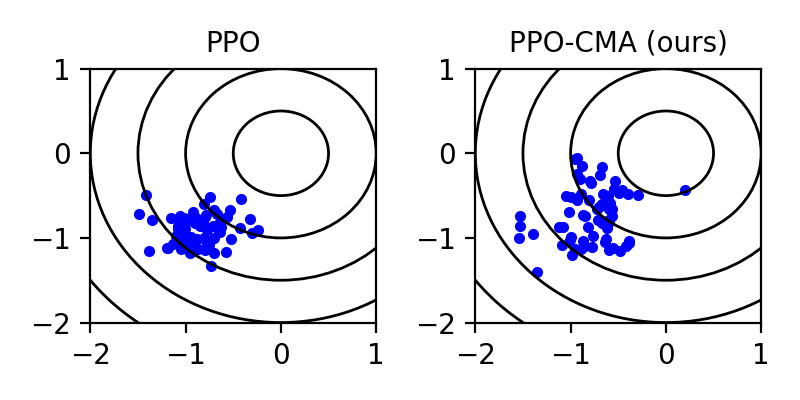
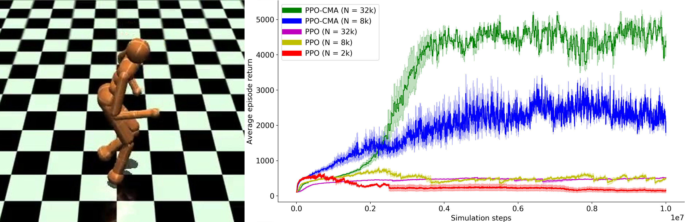

# PPO-CMA: Proximal Policy Optimization with Covariance Matrix Adaptation

This repository contains the source code for the PPO-CMA algorithm, described in [this paper](https://arxiv.org/abs/1810.02541).



The .gif above shows how PPO-CMA converges much faster than [Proximal Policy Optimization (PPO)](https://blog.openai.com/openai-baselines-ppo/), because it can dynamically expand and contract the exploration variance, instead of making monotonous progress in progressively smaller steps.

### Wait, what? That looks exactly like [CMA-ES](https://arxiv.org/abs/1604.00772). What's new about it?

The .gif above is only a special case that one can visualize easily.

The point is that we have found a way to make CMA-ES work in _deep reinforcement learning_. In the .gif, there's only one 2D action vector to optimize. In general, RL solves _several action optimization problems  in parallel_, one for each possible state of an agent such as a walking robot. Thus, a generic black-box optimization approach like CMA-ES is not directly applicable.

The key idea of PPO-CMA is use separate neural networks to store and interpolate algorithm state variables (mean and covariance for sampling/exploring actions) as functions of agent state variables (body pose, velocity etc.). This way, _we can borrow from generic black-box optimization methods in the RL domain._

We treat the so-called advantage function, estimated using [GAE](https://arxiv.org/pdf/1506.02438.pdf), as as analogous to the fitness function of CMA-ES.



# Tutorial

Using PPO-CMA is easy using ```Agent.py```. You only need the ```init()```,```act()```,```memorize()```, and ```updateWithMemorized()``` methods. The following code trains a PPO-CMA agent in the OpenAI Gym Mountain Car environment.   

```python
import gym
import tensorflow as tf
from Agent import Agent

#Simulation budget (steps) per iteration. This is the main parameter to tune.
#8k works for relatively simple environments like the OpenAI Gym Roboschool 2D Hopper.
#For more complex problems such as 3D humanoid locomotion, try 32k or even 64k.
#Larger values are slower but more robust.
N=2000

# Stop training after this many steps
max_steps=1000000

# Init tensorflow
sess = tf.InteractiveSession()

# Create environment (replace this with your own simulator)
print("Creating simulation environment")
sim = gym.make("MountainCarContinuous-v0")

# Create the agent using the default parameters for the neural network architecture
agent=Agent(
    stateDim=sim.observation_space.low.shape[0]
    , actionDim=sim.action_space.low.shape[0]
    , actionMin=sim.action_space.low
    , actionMax=sim.action_space.high
)

# Finalize initialization
tf.global_variables_initializer().run(session=sess)
agent.init(sess)  # must be called after TensorFlow global variables init

# Main training loop
totalSimSteps = 0
while totalSimSteps < max_steps:

    #Run episodes until the iteration simulation budget runs out
    iterSimSteps = 0
    while iterSimSteps < N:

        # Reset the simulation
        observation = sim.reset()

        # Simulate this episode until done (e.g., due to time limit or failure)
        done=False
        while not done:
            # Query the agent for action given the state observation
            action = agent.act(sess,observation)

            # Simulate using the action
            # Note: this tutorial does not repeat the same action for multiple steps,
            # unlike the Run.py script used for the paper results.
            # Repeating the action for multiple steps seems to yield better exploration
            # in most cases, possibly because it reduces high-frequency action noise.
            nextObservation, reward, done, info = sim.step(action[0, :])

            # Save the experience point
            agent.memorize(observation,action,reward,nextObservation,done)
            observation=nextObservation

            # Bookkeeping
            iterSimSteps += 1

    #All episodes of this iteration done, update the agent and print results
    averageEpisodeReturn=agent.updateWithMemorized(sess,verbose=False)
    totalSimSteps += iterSimSteps
    print("Simulation steps {}, average episode return {}".format(totalSimSteps,averageEpisodeReturn))

```

# Why PPO-CMA?
Although there's no convergence guarantee, CMA-ES works extremely well in many non-convex, multimodal optimization problems. CMA-ES is also almost parameter free; one mainly needs to increase the iteration sampling budget to handle more difficult optimization problems. _According to our data, PPO-CMA inherits these traits_.

The name PPO-CMA is motivated by 1) We developed the algorithm to improve the variance adaptation of [Proximal Policy Optimization](https://blog.openai.com/openai-baselines-ppo/), and 2) Despite its modifications, PPO-CMA can be considered a proximal policy optimization method, because the updated policy does not diverge outside the proximity or trust region of the old policy. The mean of the updated policy converges to approximate the best actions sampled from the old policy.

Note that PPO-CMA only works with continuous control tasks like humanoid movement. It's no good for retro Atari games where the actions are discrete button presses.

# Installation

## Prerequisites
- Python 3.5 or above
- Tensorflow
- OpenAI Gym (Optional, needed for testing with OpenAI Gym environments, e.g., in the tutorial above)
- MuJoCo (Optional, needed for OpenAI Gym MuJoCo environments)
- Roboschool (Optional, needed for OpenAI Gym Roboschool environments)

## Testing the Code
You can run ```Tutorial.py``` (the code above), or if you want to specify things like the tested environment with command line arguments, use ```Run.py```. Once you have the prerequisites installed, you should be able to use the command

```python Run.py```


All important parameters in the ```Run.py``` script are customizable with the following switches:

- ```--env_name```: OpenAI Gym or Roboschool environment name (default=MountainCarContinuous-v0)  
- ```-m``` or ```--mode```: Optimization mode, one of: PPO, PPO-CMA, or PPO-CMA-m (default=PPO-CMA-m). PPO-CMA-m is the recommended version, using the mirroring trick to convert negative advantages to positive ones.
- ```-lr``` or ```--learning_rate```: Learning rate (default=5e-4)
- ```--ppo_epsilon```: PPO epsilon (default=0.2)
- ```--ppo_ent_l_w```: PPO entropy loss weight (default=0)
- ```--max_steps```: Maximum timesteps (default=1e6)
- ```--iter_steps```: Number of timesteps per iteration (N in the paper, default=4000)
- ```--render```, Enables rendering for the first five episodes of each iteration
- ```--batch_size```: Optimization batch size (default=2048)
- ```--history_buffer_size```: PPO-CMA history buffer size (H in the paper, default=9)
- ```--n_updates```: Number of updates per iteration (default=100)
- ```--run_suffix```: Name suffix of the save directory (default="")

For example, the following command runs the PPO-CMA on the MuJoCo Humanoid-v2 environment for 10M timesteps with N = 32K, minibatch size of 512, H = 9, and name suffix of "1" (for the save directory)

```python Run.py --env_name Humanoid-v2 --max_steps 10000000 --mode PPO-CMA-m --iter_steps 32000 --batch_size 512 --history_buffer_size 9 --run_suffix 1```

## Code Structure

- ```Agent.py``` 	An easy to use agent class, the main interface to the algorithm
- ```critic.py```	The value function predictor network
- ```logger.py```   The logger script, taken from <a href="https://github.com/openai/baselines">OpenAI Baselines repository</a>
- ```MLP.py```		Neural network helper class
- ```policy.py```	The policy network
- ```Run.py```      The main script for training the models (the command line arguments explained below)
- ```utils.py```	The automatic observation scaler

# Reproducing the Plots in the Paper

Two scripts ```reproduce_convergence_plot.py``` and ```reproduce_humanoid_plot.py``` can be used for reproducing the training curve plots in the paper. Note that this may take several days.
